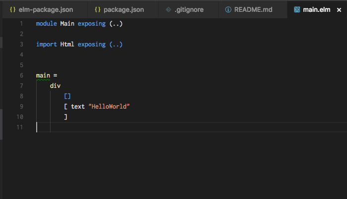
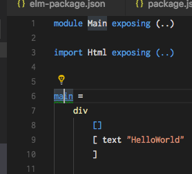
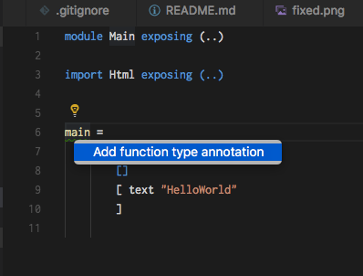
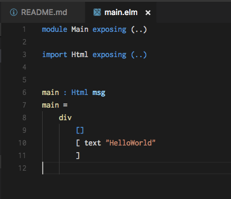

# elm-sandbox

Elm事始め。

## Table of Contents

* Elmのインストール
* エディタ(VSCode)の設定
* とりあえずハロワ
* テストでもハロワ
* elm-test と vscode の elm プラグインの協調に関して
* まとめ

## Elmのインストール

サクッとnpmから入れます。公式でもバイナリがリリースされているみたいです。

```
npm i elm -D
```

elmをインストールしたら
以下のコマンドがインストールされます。

* elm 
* elm-make コンパイラ
* elm-package パッケージマネージャ
* elm-reactor scalaで言うactivatorみたいなやつかな？
* elm-repl REPL

`elm make` とか `elm package` といった感じで使うツール群のようです。
gitっぽいですね。

今回はWeb向けにElmを使ってみたいので
言語標準のライブラリである、`elm-lang/html` をインストールします。
`-y` オプションでサクッとインストール。

```
npx elm package install elm-lang/html -y
```

## エディタ周りの設定

VSCodeでの設定をやっていきます。
下記のプラグインを使いましょう。

https://marketplace.visualstudio.com/items?itemName=sbrink.elm

ワークスペース設定に以下の設定を追加します。
フォーマットツールを入れておきます。

```
npm i elm-format -D
```

vscodeのelmプラグインのドキュメントに書かれている通り、以下のようなVSCodeのワークスペース設定を記述しておくことで、保存時フォーマットが行われます。

```json
{
  "elm.formatCommand": "./node_modules/.bin/elm-format",
  "elm.formatOnSave": true,
  "elm.makeCommand": "./node_modules/.bin/elm-make"
}
```

## とりあえずざっと書いてみる

ハロワ。
divの中にtextノードを表示しています。

```js
module Main exposing (..)

import Html exposing (..)

main =
    div
        []
        [ text "HelloWorld"
        ]
```

このままだと警告が出ているので直します。

これを



フォーカスして



クリックして



こうじゃ！！



すごい。自動で型が出てきた。便利ですね。
警告が出てきた理由はトップレベルの変数には型を書いておきましょうね、ということだそうです。

## テストでもハロワ

elm-testを使ってテストをやっていきましょう。

```
npm install elm-test -D
```

とりあえずインストールが終わったのでまずはテスト環境のセットアップです。

```
npx elm-test init
```

なんかこんな感じのテストコードが生成されます。
todoになっているのがわかります。

```js
module Example exposing (..)

import Expect exposing (Expectation)
import Fuzz exposing (Fuzzer, int, list, string)
import Test exposing (..)


suite : Test
suite =
    todo "Implement our first test. See http://package.elm-lang.org/packages/elm-community/elm-test/latest for how to do this!"

```

実行してみましょう。
こんな感じになります。

```sh
npx elm-test
# elm-test 0.18.9
# ---------------
#
# Running 1 test. To reproduce these results, run: elm-test --fuzz 100 --seed 306847917
#
#
# TEST RUN INCOMPLETE because there is 1 TODO remaining
#
# Duration: 278 ms
# Passed:   0
# Failed:   0
# Todo:     1
# ↓ Example
# ◦ TODO: Implement our first test. See http://package.elm-lang.org/packages/elm-community/elm-test/latest for how to do this!
```

Example.elmを開いて編集してまたしてもハロワしてみます。

```js
module Example exposing (..)

import Expect exposing (Expectation)
import Fuzz exposing (Fuzzer, int, list, string)
import Test exposing (..)


suite : Test
suite =
    describe "first test"
        [ todo "Hello World"
        ]
```

一応、実行するとこんな感じです。

```
$ npx elm-test
Success! Compiled 0 modules.
Successfully generated /dev/null
Success! Compiled 1 module.
Successfully generated /Users/saito.masaya/repos/elm-sandbox/elm-stuff/generated-code/elm-community/elm-test/elmTestOutput.js

elm-test 0.18.9
---------------

Running 1 test. To reproduce these results, run: elm-test --fuzz 100 --seed 708935249


TEST RUN INCOMPLETE because there is 1 TODO remaining

Duration: 277 ms
Passed:   0
Failed:   0
Todo:     1
↓ Example
↓ first test
◦ TODO: Hello World
```

ハロワできました。

しかし、ここで問題に気づきました。
VSCodeのプラグインの仕様のためにハックを一つ加えないと
毎回ダイアログが出てきてしまいます。

そこで、絶対パス指定でelm-makeのパスを設定しておきます。

ハックのために、elm-makeだけ設定を変えておきました。

```json
{
  "elm.formatCommand": "/Users/john.doe/elm-sandbox/node_modules/.bin/elm-format",
  "elm.formatOnSave": true,
  "elm.makeCommand": "/Users/john.doe/elm-sandbox/node_modules/.bin/elm-format"
}
```

一応、なぜ動かないのかということと現状どういう状況かを次で軽く書いておきます

## elm-test と vscode の elm プラグインの協調に関して

現状、elm-test と vscode の elm プラグインをうまく強調させられないです。
なぜかというと、elm-testというライブラリは `elm-test init` で生成した `tests` フォルダを生成する際に
`elm-package.json` というファイルを生成します。
しかし、vscode-elmは `elm-package.json` をベースにプロジェクトのルートを探索します。
そのため、elm-makeが見つからないよ、という結果になります。
https://github.com/Krzysztof-Cieslak/vscode-elm/blob/fde78720b7bc8281072caf3c5f140630230b527b/src/elmUtils.ts#L129

簡単に解決するにはglobalにインストールするのが早いです。

で、現状コミュニティ的にはどうなってるのか、という話を見ていきます。

まず、僕はnpmやjavaでやるような、開発向けの依存関係を `devDependencies` みたいな形で導入すればどうだろうか、ということで
issueを検索しましたところ、以下のcloseされているissueが見つかりました。
https://github.com/elm-lang/elm-package/issues/108

そこにはこんなことが書かれており、現状、楽な方法はないけどelm-testをplatformに組み込む事を考えているよ、とのこと。

> There is no easy way to do this right now. As support for elm-test comes into the Elm Platform a feature like this is planned.

このissueでは、一貫した対応を取るため、[elm-makeのissue](https://github.com/elm-lang/elm-make/issues/59)で対応するよという形になっています。

認識はしてるけど、まだ解決されていない、といったところですね。

## まとめ

感想としてはやはり、まだまだ開発途中なんだな、ということが分かる感じです。
まだまだ書いたコードは関数型って感じではないので、もう少し作り込んでみたいですね。

次はTodo Appかなんかを作ったら記事を書こうかなと思います。
